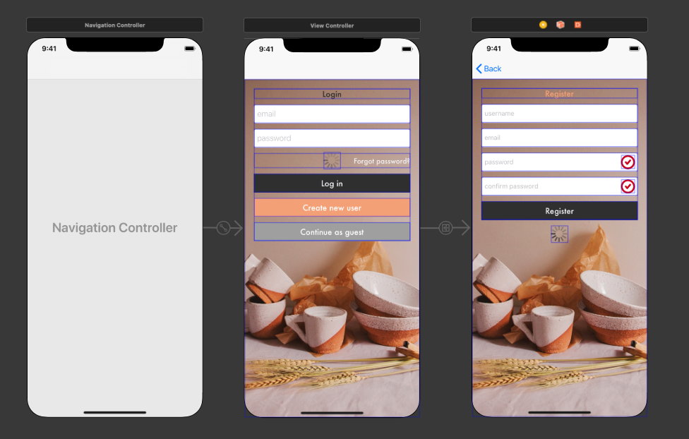
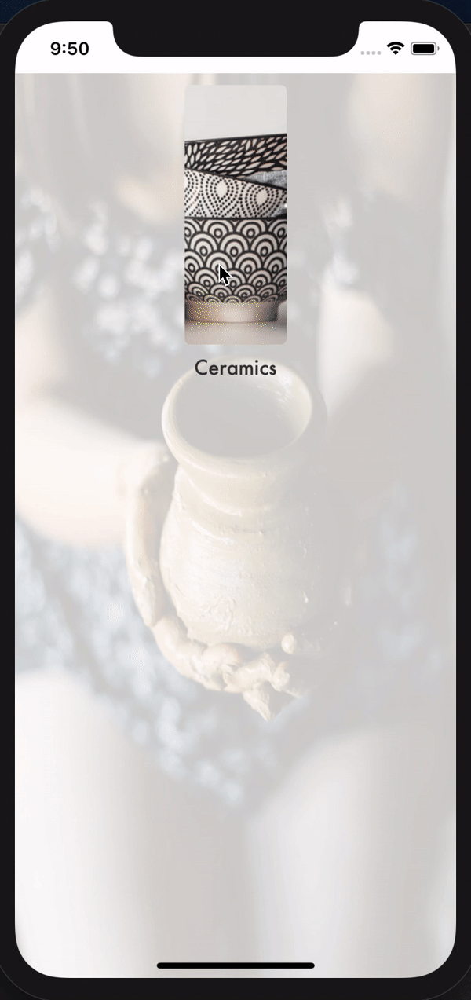
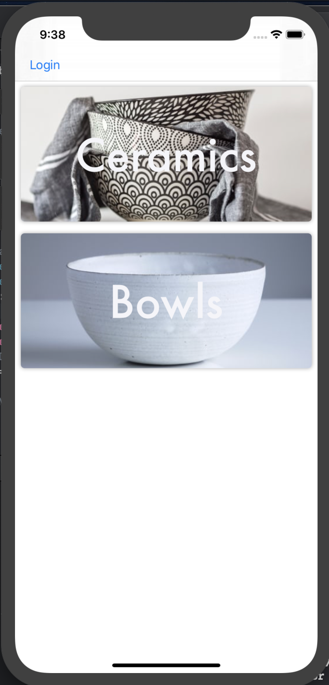
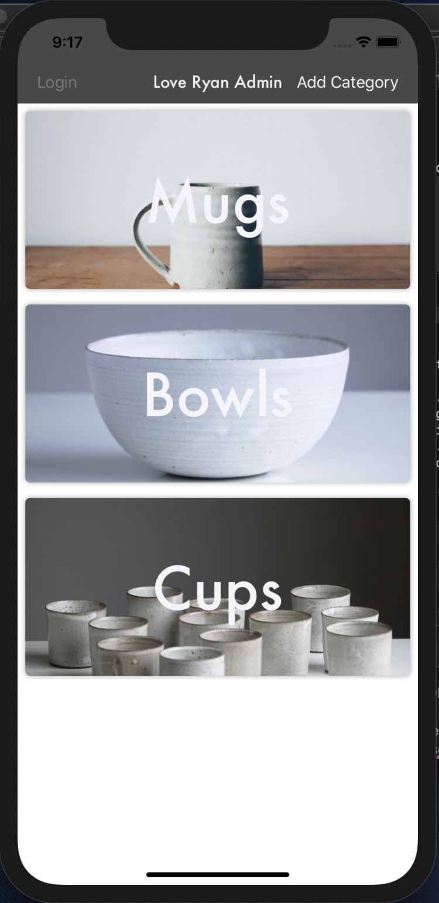
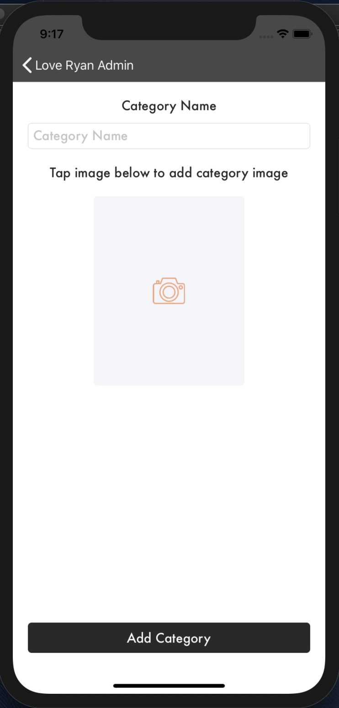
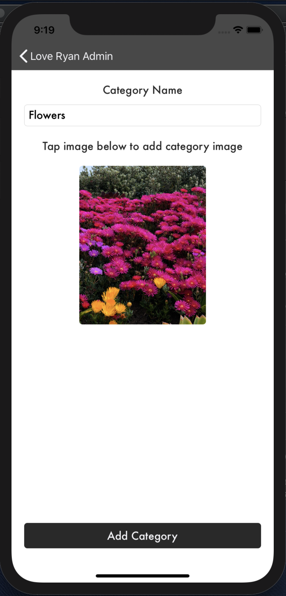
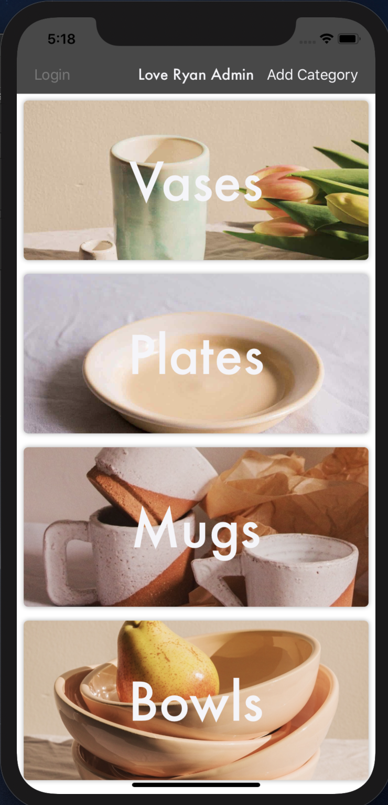
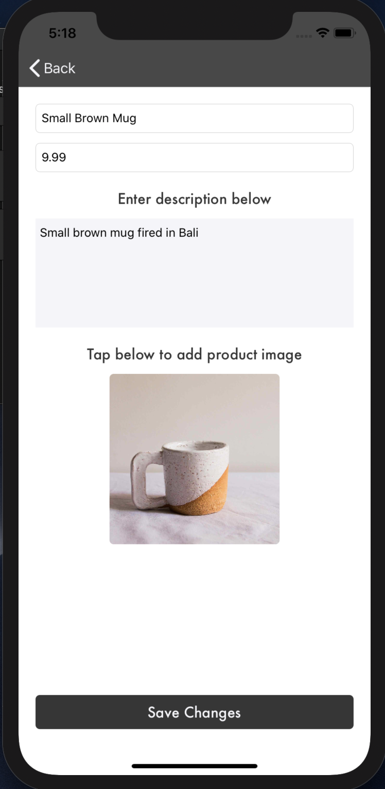
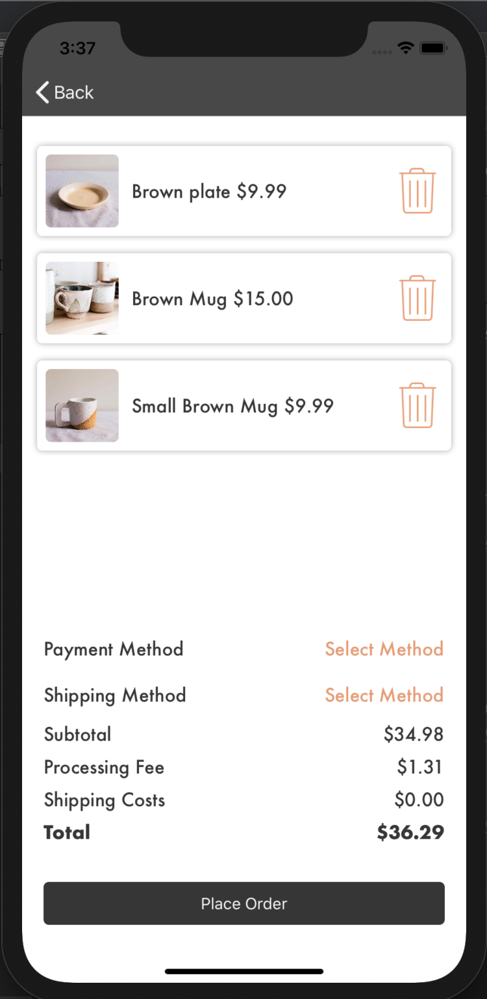

# Mobile Store (Work in progress throughout July-August)
Building an E-commerce (and Admin) application for my friend to sell his pottery. App will integrate Firebase/Firestore/Kingfisher and Stripe

## Step 1: Created initial Login and Registration front end

## Step 2: Password matching animation, user error messages, custom messages and added forgot password functionality

  

## Step 3: Started home table view, and product table view to show categories and products. Updated design.  

 

### Step 4: Initiated firestore dummy data, created functionality to parse and display data in tableView (Both for categories and products). Added functions to update tableView on database objects added, removed and edited.

### Step 5: Started admin application, copied basic storyboard design as images are shared, add category page completed with UIImage picker and tap image picker controller. Uploaded category image from picker to firestore storage, then use url to display in the app. 

  

### Step 6: Further additions to admin functionality, added admin products view controller, along with edit/add category and edit/add product view controllers. Added all correspoding UI. Added client images and test products using admin app on phone.

 

### Step 7: Add user favourite (Heart) feature/list functionality, create user service singleton so entire app can access user functionality. Clicking on heart adds to favourite's in database assinged to firebase userID Logout functionality to remove all listeners. 

### Step 8: Add node cloud functions to protect sensitive data in preparation for stripe. Cloud function triggered when new user added, gets email from new user and asigns a stripe customer id to stripeId infirebase database. 

### Step 9: Started work on shopping cart UI, added products tableView, Payment/Shipping information buttons and price labels to show relevant totals. Add and remove from cart functionality using protocals. 

## Key Learning

* Storyboard building/Auto Layout/Stackviews
* Firebase connection 
* Firebase register new users
* Password matching using controls, adding targets and actions to controls
* Added RoundedViews for images and buttons, Constants and extensions file to clean up code
* User error messages 
* Forgot password through firebase
* Custome cell Xibs for collectionView (Currently effected by error, may change) and TableView 
* Segues to move between CollectionView and tableView
* Intiated firestore with data for categories
* Fetched, parse, append, create new category and display data from firestore
* Fetch and parse collection of data from firestore 
* Added listener to immeadiately update changes in database
* Added functions to update tableView on database changes
* Added database listener and add/update/remove functionality to products
* Initialized firestore cloud storage to turn image into data upload category image data from admin app to use in both apps
* Conditional UI segues using prepare for segue function. To destination Add category/product
* Create user service singleton for entire app access to user favorited functionality

